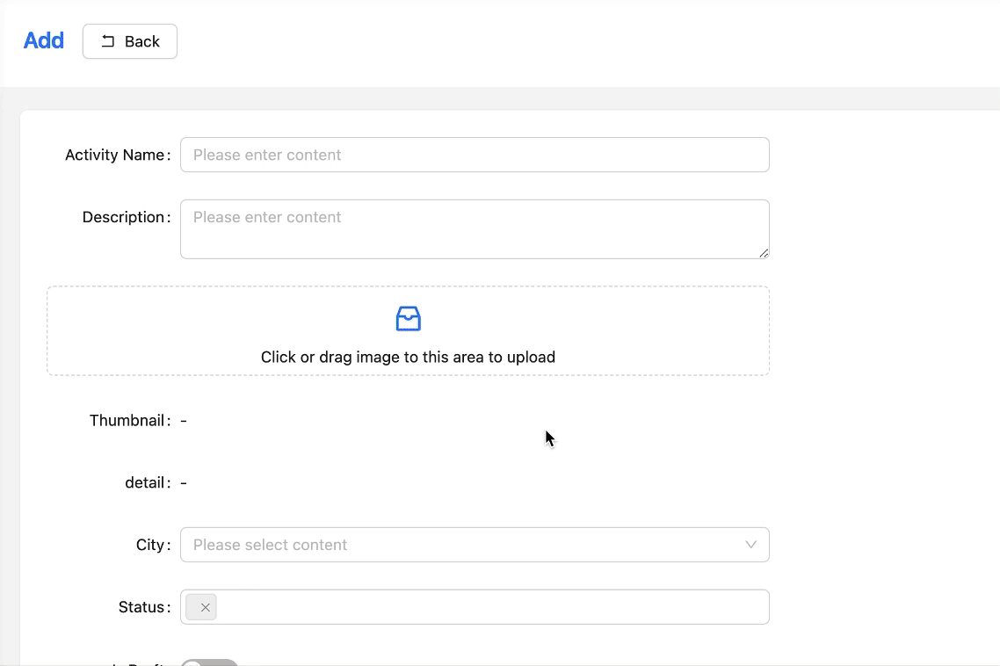

<div align="center" style="margin-bottom: 20px;">
  <a href="https://pixpro.cc/" target="_black">
    
  </a>
  <h2>PixPro AI图片处理库（AI Image Processing Library）</h2>
</div>


## 简介

PixPro 是一个图片处理工具，提供了图片处理的基础功能，如常用的裁剪、等比例缩放、翻转、镜像、旋转等功能。同时，PixPro 还嵌入了各类第三方的AI图像处理能力，例如AI 扩图、AI擦除、AI去背景、AI提升解析度（更多陆续更新..）。

您可以在任意网页端快速嵌入该工具【任意图片上传框、表单、后台等等】，即可实现无缝AI图像处理体验。



### 多平台兼容

PixPro 底层功能基于 TypeScript 进行开发，并提供 Vue3、React18、原生 HTML、Vue2 等常见库的 UI 套件（陆续更新中）。

## 演示

[PixPro 官网](https://pixpro.cc/)

## 安装

底层库
```bash
npm install @pixpro/core
```

Vue3 UI 套件
```bash
npm install @pixpro/vue
```

## 功能

### 基础功能

PixPro 提供以下基础图像处理功能：

1. **裁剪（Crop）** - 支持自定义任意裁剪比例，同时内置原始比例、1:1、4:3、16:9、9:16 等常用比例
2. **旋转（Rotate）** - 自由调整图像角度，支持指定角度旋转
3. **翻转（Flip）** - 支持水平和垂直翻转图像
4. **镜像（Mirror）** - 支持图像镜像处理
5. **缩放（Resize）** - 等比例缩放图像，保持原始比例
6. **压缩容量** - 在保证图片质量的基础上，有效降低图片的容量


### AI 高级功能

PixPro 还提供以下 AI 驱动的高级图像处理功能：

1. **AI 扩图** - 向外扩展图片，AI 自动填充图片以外的部分（详见以下 gif 展示）；


2. **AI 擦除** - 选取想要从图片中移除的物件，AI 自动擦除并修复（详见以下 gif 展示）；


3. **AI 去背景** - 一键抠出图片中的主体，可选择透明或自定义背景色（详见以下 gif 展示）；


4. **AI 提升解析度** - 提高图像清晰度，目前最大可提升至 5000 x 5000（详见以下 gif 展示）；


## 快速开始

### 底层库

```typescript
import PixPro from './pixpro';

/** 初始化 PixPro 实例 */
const pixpro = new PixPro(document.getElementById('container'), {
  token: 'your-api-token',
  merchantId: 'your-merchant-id',
  host: 'https://api.your-service.com',
  routes: '/api',
  action: {
    extend: '/extend',
    erase: '/erase',
    removeBg: '/remove-background',
    hd: '/enhance-resolution'
  },
  // 自定义裁剪比例配置
  cropRatios: {
    original: 0,      // 0 或 null 表示原始比例
    '1:1': 1,         // 正方形
    '4:3': 4/3,       // 4:3 比例
    '16:9': 16/9,     // 16:9 比例
    '9:16': 9/16,     // 9:16 比例
    '电影比例': 2.35   // 自定义电影比例
  },
  onExportImage: (image) => {
    console.log('导出的图片地址：', image);
  },
  onUpload: () => {
    console.log('图片已上传');
  }
});
```

### Vue3 UI 套件

```vue
<template>
  <div class="editor-container">
    <pix-pro-vue
      :token="token"
      :host="host"
      @export-image="handleExportImage"
      @close="handleClose"
    />
  </div>
</template>

<script setup lang="ts">
import { ref } from 'vue'
import { PixProVue } from '@pixpro/vue'
import '@pixpro/vue/dist/index.css'

const token = 'your_token'
const host = 'https://api.example.com'

const handleExportImage = (imageData: string) => {
  console.log('导出的图片数据:', imageData)
}

const handleClose = () => {
  console.log('编辑器关闭')
}
</script>

<style>
.editor-container {
  width: 100%;
  height: 600px;
}
</style>
```

### API 参考

#### 主要方法

| 方法 | 描述 | 参数 |
| --- | --- | --- |
| `new PixPro(element, options)` | 初始化 PixPro 实例 | `element`: DOM元素, `options`: 配置选项 |
| `rollback()` | 回退到上一步 | - |
| `forward()` | 前进到下一步 | - |
| `reset()` | 恢复到初始状态 | - |
| `status()` | 获取当前状态 | - |
| `flip(direction)` | 水平或垂直翻转 | `direction`: 'x' 或 'y' |
| `cropRatio(options)` | 设置裁剪比例 | `options`: {ratio: number \| null, label: string} |
| `rotate(angle)` | 旋转图像 | `angle`: 旋转角度(度) |
| `exportImage()` | 导出图像 | - |
| `expandImageBtn()` | AI 扩图 | - |
| `eraseImage()` | AI 擦除 | - |
| `setEraserSize(size)` | 设置橡皮擦大小 | `size`: 橡皮擦尺寸 |
| `removeBg()` | AI 去背景 | - |
| `hd()` | AI 提升解析度 | - |
| `setRemoveBgColor(color)` | 设置去背景后的背景颜色 | `color`: 颜色值 |
| `resetAll()` | 重置所有操作 | - |

#### 初始化选项

| 选项 | 类型 | 必填 | 描述 |
| --- | --- | --- | --- |
| `token` | string | 是 | 请求 token |
| `host` | string | 是 | 请求 host |
| `routes` | string | 是 | 请求 routes |
| `action` | object | 是 | 请求 action 对象 |
| `action.extend` | string | 是 | 扩图接口路径 |
| `action.erase` | string | 是 | 擦除接口路径 |
| `action.removeBg` | string | 是 | 去背景接口路径 |
| `action.hd` | string | 是 | 提升解析度接口路径 |
| `cropRatios` | object | 否 | 自定义裁剪比例配置 |
| `onStepChange` | function | 否 | 步骤变化回调 |
| `onExportImage` | function | 否 | 导出图片回调 |
| `onFinish` | function | 否 | 结束回调 |
| `onUpload` | function | 否 | 上传回调 |
| `realTimeChange` | function | 否 | 实时变化回调 |
| `isDev` | boolean | 否 | 是否是开发模式 |

```typescript
// onStepChange 回调函数类型
type OnStepChangeCallback = ({ 
  stepList, 
  currentStepIndex 
}: { 
  stepList: IDrawCanvasInfo[], 
  currentStepIndex: number 
}) => void;

// onExportImage 回调函数类型
type OnExportImageCallback = (image: string) => void;

// 裁剪比例配置类型
type CropRatios = {
  [key: string]: number | null;  // 键为比例名称，值为比例数值，0 或 null 表示原始比例
};

// 完整配置示例
const options = {
  token: 'your-api-token',
  merchantId: 'your-merchant-id',
  host: 'https://api.your-service.com',
  routes: '/api',
  action: {
    extend: '/extend',
    erase: '/erase',
    removeBg: '/remove-background',
    hd: '/enhance-resolution'
  },
  // 自定义裁剪比例配置
  cropRatios: {
    original: 0,      // 0 或 null 表示原始比例
    '1:1': 1,         // 正方形
    '4:3': 4/3,       // 4:3 比例
    '16:9': 16/9,     // 16:9 比例
    '9:16': 9/16,     // 9:16 比例
    '电影比例': 2.35   // 自定义电影比例
  },
  onExportImage: (image) => {
    console.log('导出的图片地址：', image);
  },
  onUpload: () => {
    console.log('图片已上传');
  }
};
```

### 许可证

PixPro 使用 [MIT 许可证](./LICENSE)。